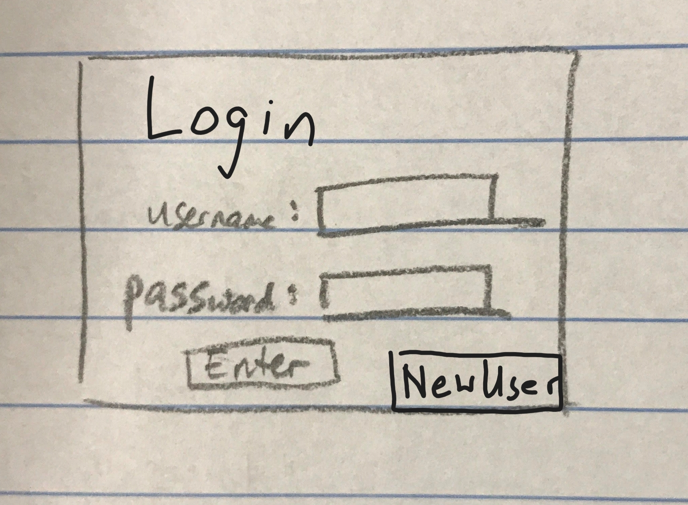
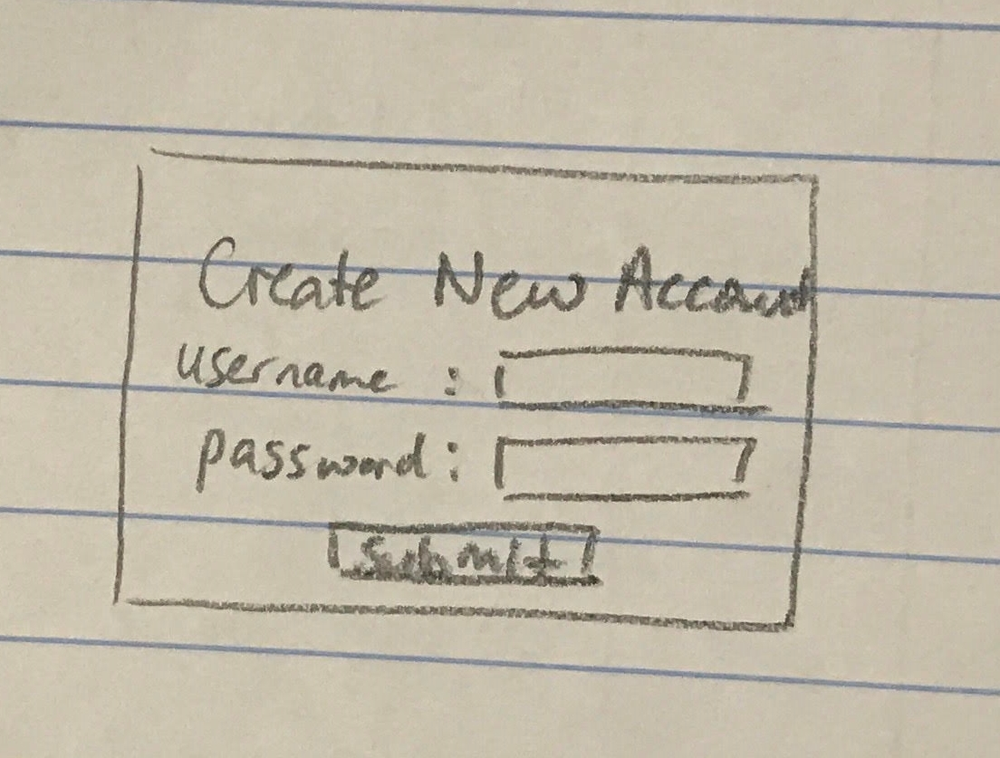
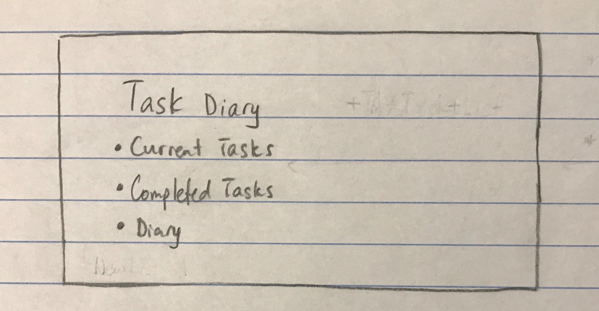
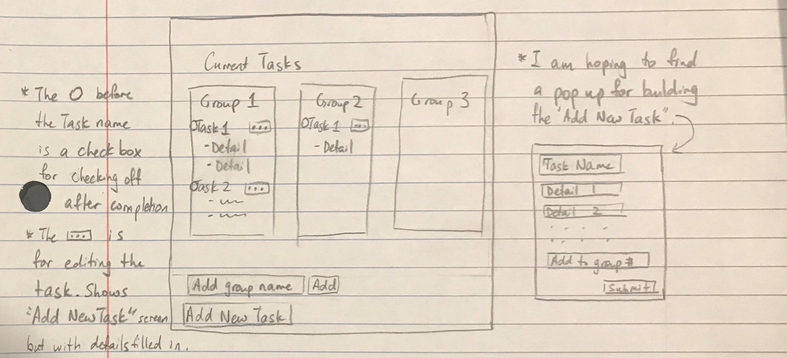
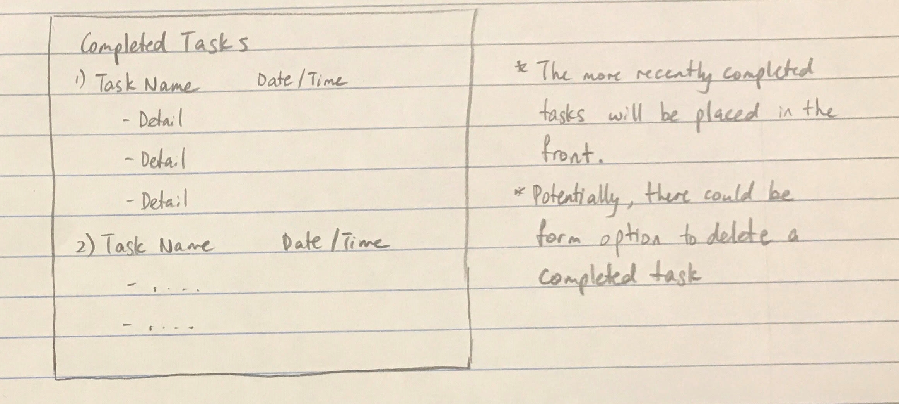
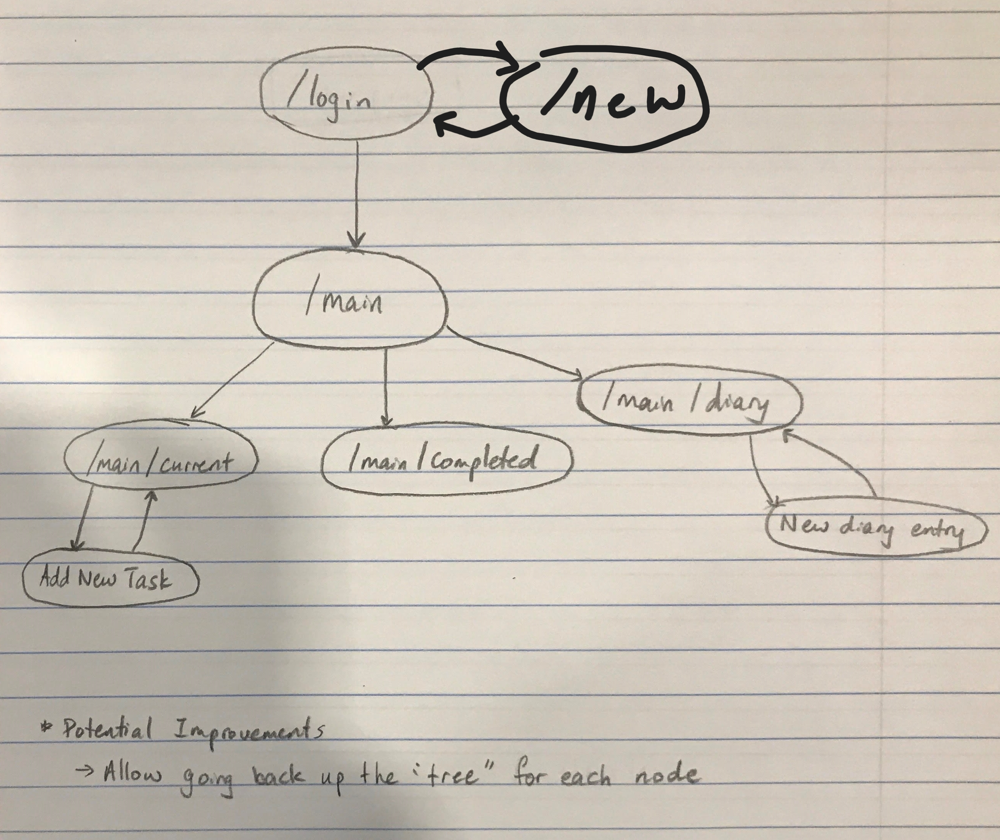

# Task Diary

## Overview

There are many tasks to do every day. In order to keep track of the tasks to do, we may use a text document or Post-its. However, the general result is that the details of the task will be deleted or thrown away once the task is completed. With so many tasks that are done each day, it will become hard to keep track of the times that the specific tasks have been completed.

Task Diary is a web application that attempts to keep track of every task that the user adds to the app, even after completion. Multiple timestamps will be added to each task to help the user recall the details of the task. The user could also optionally write a diary using the app with the assistance of a list of new objectives and completed tasks of the day.


## Data Model

The application will store User, CurrentTask, CompletedTask, and Diary

* Each User stores references to the CurrentTask, CompletedTask, and Diary objects (via references)
* Each CurrentTask object will include the current tasks that the user has not completed
* Each CompletedTask object stores a completed task that the user completed
* Each Diary object stores the details of a day.

An Example User:

```javascript
{
  username: "user1",
  hash: // a password hash,
  CurrentTasks: // an array of references to the current tasks of the user
  CompletedTasks: //an array of references to the completed tasks of the user
  CurrentTasksGroupNames: //an array of group names that the user creates to sort the current tasks
  Diary: //an array of references to the diary pages of the user
}
```

An Example CurrentTask:

```javascript
{
  user: // a reference to a User object
  createdAt: //Time of creation of this object
  title: //The subject or focus of the task
  taskDetails: //an array that stores details of the task (via bullet points).
  estimatedCompletionTime: //The amount of time that it may take to finish the task 
  group: //The index of the group to display the current task on
}
```

An Example CompletedTask:

```javascript
{
  user: // a reference to a User object
  createdAt: //Time of creation of this object
  title: //The subject or focus of the task (written by user)
  taskDetails: //an array that stores details of the task (via bullet points by the user).
  estimatedCompletionTime: //The amount of time the user thinks it may take to finish the task 
  completedAt: //Finish time of the task
}
```

An Example Diary:

```javascript
{
  user: // a reference to a User object.
  createdAt: //Time of creation of this object. 
  date: //The date the diary is for.
  title: //The subject or focus of the diary. (data + title will be the title of the diary page shown to the user)
  details: //The diary record for the day
  completedAt: //Finish time of the task
}
```


## [Link to Commented First Draft Schema](db.js) 

## Wireframes

/login - login page of the web app. <!-- The site might or might not try logging in through google first. -->



/new - page to create a new account



/main - page that indicates features of the web application



/main/current - page that includes all the current tasks



/main/completed - page that indicates all completed tasks



/main/diary - page that includes all the diary entries


## Site map



## User Stories or Use Cases

1. as non-registered user, I can register a new account with the site.
2. as a user, I can log in to the site.
3. as a user, I access the current tasks, completed tasks, and diary.
4. as a user, I add a new task to the current tasks page.
5. as a user, I can check off the task and details of the task to indicate completion.
6. as a user, I can edit the tasks that was already created.
7. as a user, I can create groups for the current tasks page to sort the tasks.
8. as a user, I can search specific diary entries that I previously wrote.
9. as a user, I can create a new diary entry.
10. as a user, I can see all the completed tasks.

<!--
11. as a user, I can delete completed tasks.
12. as a user, I can log out.
 -->

## Research Topics

* (3 points) Unit testing with JavaScript - Mocha
    * This is a library that is used for testing the functions in JavaScript.
    * It is useful for making sure that the functions for the website is written correctly.
    * I'm going to try writing my own mocha code for testing my functions.
* (5 points) Functional testing for all of my routes - Selenium
    * This is a library that is used for testing the web browser to make sure that user interactions work. It automates the user interaction, so tests can be written for it. <!-- I think this is how it works -->
    * This should solve the problem of having to test whether the web application works after every single change.
* (x points) Perform automatic authentication (or provide option) if the user is signed into google.
    * Other websites have ways to login through another site.
    * There would be a way to sign in through /login window, or the user can choose to sign in through google account.

8+x points total out of 8 required points


## [Link to Initial Main Project File](app.js) 

## Annotations / References Used

1. [passport.js authentication docs](http://passportjs.org/docs) - (db.js, /routes/index.js)
<!-- 2. [tutorial on vue.js](https://vuejs.org/v2/guide/) - (add link to source code that was based on this) -->

